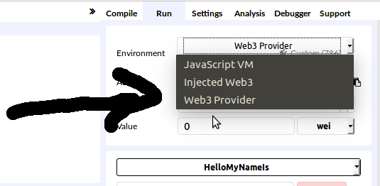

---
author:
  - Bèr `berkes` Kessels
title: Write Smart Contracts on Blockchains
subtitle: "Een workshop waarin we de wereld van Smart Contracts op de Ethereum blockchain induiken."
abstract: "In deze twee uur durende workshop bouwen ons eigen munteenheid en schrijven we contracten waarmee we die munten kunnen gebruiken om code op de blockchain te draaien. We leren hoe het Ethereum netwerk in elkaar zit en hoe je op deze blockchain kunt programmeren."
keywords:
  - Blockchain
  - Ethereum
  - Smart Contracts
  - Workshop
lang: nl
---

# Over
## Over Bèr Kessels

* Bèr Kessels
* @berkes, github.com/berkes
* Ruby, Blockchain en Open Source developer
* Iets met fintech.

## Over de presentatie

* Staat op: [github.com/berkes/ethpres](http://github.com/berkes/ethpres)
* URL komt aan het einde nog eens voorbij.

## Notes en prikbord

http://piratepad.net/ZDhQsgpF4k

## Over mij en Blockchain

* April 2011 begonnen met Bitcoin
* In de beginfase van enkele startups rondom Ethereum.

## Inhoud

* Intro?
* Hello World
* What we just did
* BroodFonds

## Vraag:

* Wie heeft geen idee wat Blockchain, Bitcoin of Ethereum is?
* Of wat een Smart Contract is?

# Intro
## Blockchain

> Consensus
> Trustless
> Distributed
>
> Permissionless

## Wat is een Blockchain?

Een **onveranderlijke**, gedistribueerd grootboek

An Immutable, Distributed Ledger

## Wat bedoelen we met een grootboek?

Een "database" met daarin informatie als saldi, eigendomsbewijzen, smart
contract status.

## Gedistribueerd?

* Peers verbonden in een netwerk
* Peers kunnen wegvallen
* Peers kunnen zich kwaadaardig gedragen:
     + Blockchain moet dan nog altijd functioneren
     (Byzantine fault tolerance)

## Waarom Gedistribueerd?

* Geen centraal "point of failure"
* Kan wereldwijd opschalen
* Trustless, Uncensorable, Permissionless

## Onveranderlijk? (Immutable)

* Data kan niet aangepast worden nadat het in het grootboek is weggeschreven
* Data is controleerbaar
* Er is concensus nodig om het grootboek bij te werken

## Wat is concensus?

* "Iedereen" komt overeen wat de huidige status is
    + Bijvoorbeeld: wat zijn de saldi van iedereens rekeningen

## Hoe komen we tot concensus?

* Consensus algoritmes
    + Proof of work, Proof of stake

## Wat is Ethereum

* Ethereum is een decentraal platform ontworpen om smart contracts op te draaien
    + geen single point of control/failure
    + censorship resistant
* Gedistribueerde state machine
    + (block met) transactions == state transition function
    + Of gewoon een decentrale computer

## Wat is een Smart Contract?

* **geen** contract in de zin van een papier met kleine
    lettertjes juridische taal en handtekeningen
* Een "class" met functies die code uitvoert

## Web 3.0 / dApps

* **Geen centraal controlerende instantie**. Je appartement verhuren is tussen
    jou en de huurder. AirBnB of andere "Siren Servers" hebben daarin
    geen plek.
* **Data eigendom**. Je blijft eigenaar van jou data. Jij kunt deze
    verkopen. Of niet.
* **Minder heftige hacks**. Decentraal betekent dat een hacker het hele
    netwerk moet overnemen om toegang te krijgen, ipv een centrale server.
* **Permissionless**. Of je nu een onderdrukte minderheid, of gezochte
    terrorist bent, niemand kan je toegang onthouden tot diensten.
* https://medium.com/@matteozago/why-the-web-3-0-matters-and-you-should-know-about-it-a5851d63c949

# Hello World

## Code
~~~javascript
pragma solidity ^0.4.0;

contract HelloMyNameIs {
  string name;
  address issuer;

  function HelloMyNameIs() public {
    issuer = msg.sender;
  }

  modifier ifIssuer () {
    require(issuer == msg.sender) ;
    _;
  }

  function getName() public constant returns(string) {
    return name;
  }

  function setName(string newName) ifIssuer public returns(string) {
    name = newName;
    return name;
  }
}
~~~

## Remix IDE

### Steps:

* http://remix.ethereum.org (NOTE: HTTP, not HTTPS)
* Verbind met private net
* Plak of schrijf het contract
* Compile, Create
* Interact

## Verbind met private net

* Use url from slack
* Kies een van de accounts met 20.00 ETH in de dropdown

## Plak of schrijf het contract

* [http://bit.ly/2BiXfAm](http://bit.ly/2BiXfAm)
* Repareer errors
* Klaar?

## Compile en deploy

### Publiceer op de ethereum blockchain.

* Kies "Create"
* Krijg een account: adres
* Fouten?

## Interact

### Gebruik het contract

* Alle functies hebben een invoer: knop of knop+textfield
* schrijf `"World"` naast `setName`. Let op de `"`
* Gebruik nu `getName` om de naam uit te lezen
* Speel wat rond
* Post je contract-adres op slack

## Interact met ander contract

* Laad het contract van één van je collega's in, of gebruik
  `0x0f34b963a09031434b447355218cd8a1b999663f`
* gebruik hiervoor `At Address` formulier
* Probeer `setName`, merk de foutmelding op

# What we just did

## Compile en deploy

* Met de "Web3.js" API compileren en deployen
* Dit wordt een "account": een entiteit met een wallet, op een adres

## Interactie via formulieren

* Contract heeft een ABI, Application Binary Interface
* Bescrhijft de interface van een contract
* Een client kan dan functies aanroepen op het contract

## Clients

* geth, web3 in een REPL
* mist wallet
* remix IDE
* JS op jou site
* andere wallets?

## Gas

* Draaien van code kost wat:

* Note `gas`

## Gas, Ethers, Gwei

* Ether is betaalmiddel
* Uitgedrukt in "wei", kleinst deelbare eenheid
* 1e18 wei = 1 ether
* gas is dynamisch, 1 gas kost X wei
  [https://ethgasstation.info/](https://ethgasstation.info/)

## Operaties kosten Gas

* Iedere operatie kost gas
* Sommige operaties zijn duur, andere goedkoop
* Wanneer er te weinig gas is, wordt een OutOfGas exceptie geraised

## Waarom Gas?

* Gebruiker/aanvaller betaalt
* Endless loops niet mogelijk (Halting problem)
* Miners ontvangen gas voor het draaien van de code

## Solidity

* Defacto standaardtaal voor het schrijven van Ethereum smart contracts
* Alternatieven: Serpent (Python), LLL (Lisp), Viper (Python), Bamboo (OCaml)

# Broodfonds.sol

## Broodfonds

### In een notendop:

* uitkering voor ondernemers bij ziekte, betaald door mede-ondernemers
* basisidee: klein, hecht netwerk

## Broodfonds voorwaarden

* Given you have deposited this month
* And you have called in sick at least 2629800 seconds ago (one month)
* And at least half of the participants have acknowledged your sick call
* Then you may withdraw at most 22 * your deposit each month until you
    call in better

## pragma, contract, init

~~~javascript
pragma solidity ^0.4.0;

contract BroodFonds {
  address public chairperson;

  function BroodFonds() public {
    chairperson = msg.sender;
  }
}
~~~

## Chairman: storage, scoping, types

* State variables zijn `storage`. Storage is duur.
* Method arguments zijn `memory` by default. Memory wordt weggegooid na
    het draaien, maar is goedkoper.
* Scope `public` geeft een getter.
* Scope `private` maakt niet dat externen de waarde niet kunnen zien!
* Type `address` is een intern type. Verwijst naar een account.
* `msg` is een interne variabele, bevaat informatie over de aanroeper.

## require, modifier

~~~javascript
modifier ifParticipant() {
  require(participants[msg.sender].exists);
  _;
}

function callInSick() ifParticipant public {
  participants[msg.sender].calledInSick = block.timestamp;
}
~~~

## Wat gebeurt hier wanneer een niet-deelnemer ziek meldt?

## modifiers beschermen een functie met condities.

### Doet hetzelfde:
~~~javascript
function callInSick() ifParticipant public {
  require(participants[msg.sender].exists);
  participants[msg.sender].calledInSick = block.timestamp;
}
~~~

## Events

~~~javascript
event CalledInSick(address caller);

function callInSick() ifParticipant public {
  participants[msg.sender].calledInSick = block.timestamp;
  CalledInSick(msg.sender);
}
~~~

## Event-listeners.

* SAAS diensten die mailen, push-notificaties sturen etc.
* Eigen contracten laten triggeren.
* Eigen code laten triggeren.

## selfdestruct

~~~javascript
function kill() public onlyowner {
  selfdestruct(owner);
}
~~~

## Kill-switch

* Bouw altijd meerdere lagen beveiliging in.
* De laatste laag is een kill-switch, waarbij een persoon alle fondsen
    krijgt.
* Verbeteringen: meerdere lagen, één waarbij alle deelnemers naar rato
    krijgen.
* Verbetering: stuur niet naar de chairperson, maar naar een ander
    contract wat het geld bijv. x maanden vasthoud, of verdeelt over
    deelnemers.

## Re-entry bug

~~~javascript
function withdraw(uint amount) ifWithdrawalCorrect ifParticipant public {
  participant = participants[msg.sender];
  require(participant.credit > amount);
  msg.sender.transfer(amount);
  participant.credit = participant.credit - amount;
}
~~~

## Re-entry explained

1. Contract Mallory calls `withdraw()`
2. Contract BroodFonds runs up to `msg.sender.transfer()`
3. Contract `transfer` operation hands back to Mallory
4. Mallory calls back in, and can withdraw again

# Tijd? Vragen?

## Presentatie

* [github.com/berkes/ethpres](github.com/berkes/ethpres)

## URLs And References

* Solidity documentation: https://solidity.readthedocs.io/en/develop/
* Do you need a blockchain?: https://medium.com/@sbmeunier/when-do-you-need-blockchain-decision-models-a5c40e7c9ba1#.suev52ycl
