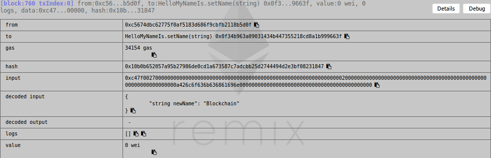

---
author:
  - Bèr `berkes` Kessels
title: dApp en Blochain Development
subtitle: "Een workshop waarin we de wereld van Smart Contracts op de Ethereum blockchain induiken."
abstract: "In deze  workshop bouwen ons eigen crowdfundplatform voor Feesten en Partijen."
keywords:
  - Blockchain
  - Ethereum
  - Smart Contracts
  - Workshop
lang: nl
---

# Over
## Over Bèr Kessels

* Bèr Kessels
* @berkes, github.com/berkes
* Ruby, Blockchain en Open Source developer
* Founder van PlaceBazaar

## Over de presentatie

* Staat op: [github.com/berkes/ethpres](http://github.com/berkes/ethpres)
* URL komt aan het einde nog eens voorbij.

## Notes en prikbord

http://piratepad.net/ZDhQsgpF4k

## Over mij en Blockchain

* April 2011 begonnen met Bitcoin
* In bouw aan een startup, placebazaar.org. Bouw dit op Ethereum

## Inhoud

* Welk probleem lost Blockchain op?
* Wat is een Smart Contract?
* Wat is een dApp (Web 3.0)?
* Wat is Ethereum?

## Wat is Blockchain?

Een onveranderlijk, gedistribueerd grootboek

*An Immutable, Distributed Ledger*

## Wat bedoelen we met een grootboek?

Een database met daarin opeenvolgende transacties:

Beginstand: Anne: 6, Bob 0, Carol 1

1. **Anne** geeft 5 aan **Bob**
1. **Bob** geeft 2 aan **Carol**
1. **Carol** geeft 1 aan **Anne**

Eindstand: Anne 2, Bob 3, Carol 1

## Gedistribueerd:

### Doen!

## Centraal, Decentraal, Gedistribueerd

## Wat zagen we?

Gedistribueerd (cash) is:

* Trustless (vertrouwenloos).
* Permissionless (vergunningsvrij)
* Uncensorable (oncensureerbaar)
* Verifiable (controleerbaar)

## Dat komt voort uit "Distributed"

* Geen centraal "point of failure"
* Kan wereldwijd opschalen
* Heet ook wel "Peer to Peer, P2P"

## Waarom werkt muntgeld?

Ideeën?

## En hoe moet dat digitaal?

* Tot 2008 werd dit onmogelijk geacht
* Altijd via centrale autoriteiten

## Centraal:

### DOEN

## Een blockchain!

Een onveranderlijk, gedistribueerd grootboek!

## Digitaal Gedistribueerd:

### DOEN

* 5 Personen naar voren.
* Krijgen een "digitale kasboek"
* Anne betaalt 2 BTC aan Bob
* Bob probeert aan Carol 3 BTC te betalen
* Carol betaalt 0.5 BTC aan Bob

## DOEN 2

## Hoe kan dit werken?

Ideeën?

## Onveranderlijk? (Immutable)

* Data kan niet aangepast worden nadat het in het grootboek is weggeschreven
* Data is controleerbaar
* Er is consensus nodig om het grootboek bij te werken

## Wat is consensus?

* "Iedereen" komt overeen wat de huidige status is
    + Bijvoorbeeld: wat zijn de saldi van iedereens rekeningen

## Distributed

* Complex
* Maar zonder centrale partijen!

# Ethereum

* Ethereum is een decentraal platform ontworpen om software op te draaien
    + geen single point of control/failure
    + censorship resistant
* Gedistribueerde state machine
    + (block met) transactions == state transition function
    + Of gewoon een decentrale computer
* Software: Smart Contracts

# Wat is een Smart Contract?

* **geen** contract in de zin van een papier met kleine
    lettertjes juridische taal en handtekeningen
* Een stuk software
* Een "class" met functies die code uitvoert

## Code
~~~javascript
pragma solidity ^0.4.0;

contract HelloMyNameIs {
  string name;
  address issuer;

  function HelloMyNameIs() public {
    issuer = msg.sender;
  }

  function getName() public constant returns(string) {
    return name;
  }

  function setName(string newName) public returns(string) {
    require(issuer == msg.sender) ;
    name = newName;
    return name;
  }
}
~~~

# Wat is een dApp (Web 3.0)?

* Een interface voor een of meerdere Smart Contracts.
* Een applicatie die Smart Contracts gebruikt.

## De voordelen?

* **Geen centraal controlerende instantie**. Je appartement verhuren is tussen
    jou en de huurder. AirBnB of andere "Siren Servers" hebben daarin
    geen plek.
* **Data eigendom**. Je blijft eigenaar van jou data. Jij kunt deze
    verkopen. Of niet.
* **Minder heftige hacks**. Decentraal betekent dat een hacker het hele
    netwerk moet overnemen om toegang te krijgen, ipv een centrale server.
* **Permissionless**. Of je nu een onderdrukte minderheid, of gezochte
    terrorist bent, niemand kan je toegang onthouden tot diensten.

## Smart Contract proberen

* Ga naar [HelloMyNameIsOpen](https://rinkeby.etherscan.io/address/0xe002102bcdf8ea289f5e3cbed4ca1d6063b45fc5) (link op eterpad)
* Onder "Read" bekijk de huidige naam.
* Onder "Write" connect met metamask.
* Verander de naam. Kies  "write". Bevestig in MetaMask.
* Bekijk transactions. Bekijk de naam.

## Zelf een Smart Contract releasen

# Remix IDE

### Steps:

* https://remix.ethereum.org
* Verbind met MetaMask.
* knip/plak het contract "HelloMyNameIs" naar remix IDE: link in etherpad
* Compile, Create.
* Interact.

### Gebruik het contract:

* Alle functies hebben een invoer: knop of knop+textfield
* schrijf bijvoorbeeld `"World"` naast `setName`. Let op de `"`
* Gebruik nu `getName` om de naam uit te lezen
* Speel wat rond.
* Post je **contract**-adres op de etherpad

## Interact met ander contract

* Laad het contract van één van je collega's in.
* gebruik hiervoor `At Address` formulier.
* Probeer `setName`, merk de foutmelding op.

# What we just did

## Compile en deploy

* Met de "Web3.js" API compileren en deployen.
* Dit wordt een "account": een entiteit met een wallet, op een adres.
* Twee soorten accounts: contracts (zonder private key) en users (met
    private key)

## Interactie via formulieren

* Contract heeft een Interface (ABI).
* Een client kan dan functies aanroepen op het contract.
* Iedere interactie met state-change is een *transactie*.

## Clients

* **CLI:** geth, web3/node.js, solc
* **Officiëel:** mist wallet
* **Web:** remix IDE
* **dApp:** JS op jou site
* En vele andere wallets

## Transacties

* Transactie is een verandering, write, op blockchain uitvoeren.
* Succesvol aanroepen van `setName` is een transactie.
* Leesacties zijn `gratis` en instant.
* Transacties duren even.

## Gas

* Draaien van code kost wat:

* Note `gas`
* Alle `OPCODES` hebben vooraf bepaalde gas-cost

## Gas, Ethers, Gwei

* Ether is betaalmiddel
* Uitgedrukt in "wei", kleinst deelbare eenheid
* 1e18 wei = 1 ether
* gas is dynamisch, 1 gas kost X wei
  [ethgasstation.info](https://ethgasstation.info/)

## Operaties kosten Gas

* Iedere operatie kost gas
* Sommige operaties zijn duur, andere goedkoop
* Wanneer er te weinig gas is, wordt een OutOfGas exceptie geraised

## Waarom Gas?

* Gebruiker/aanvaller betaalt
* Endless loops niet mogelijk (Halting problem)
* Miners ontvangen gas voor het draaien van de code

## Solidity

* Defacto standaardtaal voor het schrijven van Ethereum smart contracts
* Alternatieven: Serpent (Python), LLL (Lisp), Viper (Python), Bamboo (OCaml)

# FundFissa

## Security

* It runs forever. Immutable.
* Kill-switch
* Logical errors
* Programming errors

## Presentatie

* [github.com/berkes/ethpres](github.com/berkes/ethpres)
